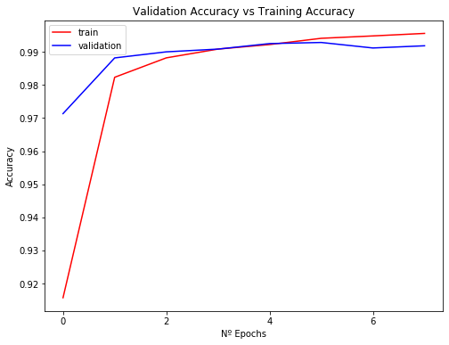
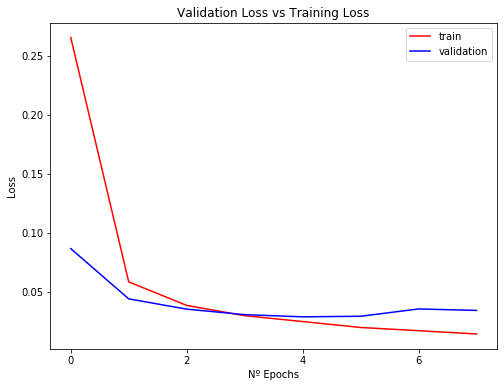

```python
#!/usr/bin/env python

import keras
from keras.datasets import mnist
from keras.models import Sequential
from keras.utils import to_categorical
from keras.layers.core import Dense, Activation, Dropout
from keras.layers import Conv2D, MaxPooling2D, Flatten
import numpy as np
import matplotlib.pyplot as plt
import time
from sklearn.model_selection import train_test_split
from keras.callbacks import EarlyStopping
from keras.callbacks import ModelCheckpoint, ReduceLROnPlateau
from keras.models import load_model
from keras.layers.normalization import BatchNormalization


# nº de instancias que se realizan antes de una actualización de pesos
batch_size = 128 
# nº iteraciones que se ejecuta el proceso de entrenamiento
epochs = 50#28
# % reservado para datos de validación
test_size = 0.1 
# mezcla los datos en cada época
shuffle=True 

# medida de error
loss="categorical_crossentropy"
# Optimizacion 
optimizer="RMSprop"

#precarga de los datos de mnist que contiene keras
(x_train, y_train), (x_test, y_test) = mnist.load_data()

# añadimos una dimension para convolucion
x_train = x_train.reshape(x_train.shape+(1,))                                    
x_test = x_test.reshape(x_test.shape+(1,)) 

# normalización de los datos de entrada
x_train = x_train.astype('float32')
x_test = x_test.astype('float32')

x_train /= 255
x_test /= 255

#categorial
y_train = to_categorical(y_train, num_classes=10)
y_test = to_categorical(y_test, num_classes=10)

#dibido conjunto de entrenamiento y validación
X2_train, X_val, Y2_train, Y_val = train_test_split(x_train, y_train, test_size = test_size, random_state=42)

#clase secuencial para definición de modelo
model = Sequential()

model.add(Conv2D(16, kernel_size=(3, 3),activation='relu',
                 input_shape=x_train.shape[1:]))
model.add(Conv2D(32, (3, 3), activation='relu'))
model.add(MaxPooling2D(pool_size=(2, 2)))
model.add(Dropout(0.1))
model.add(Conv2D(32, (3, 3), activation='relu'))
model.add(Conv2D(64, (3, 3),padding='same', activation='relu'))
model.add(MaxPooling2D(pool_size=(2, 2)))
model.add(Conv2D(64, (3, 3), activation='relu'))
model.add(Conv2D(128, (3, 3),padding='same', activation='relu'))
model.add(MaxPooling2D(pool_size=(2, 2)))
model.add(Flatten())
model.add(Dropout(0.1))
model.add(Dense(128, activation='relu'))
model.add(Dense(10, activation='softmax'))


# comprobar architectura de nuestro modelo.
model.summary()
#######################################################
model.compile(loss=loss,
optimizer=optimizer,
metrics = ['accuracy'])

earlystop = EarlyStopping(monitor='val_loss', 
                          min_delta=0.001,
                          verbose=1, 
                          patience=3, 
                          mode='auto')
modcheck = ModelCheckpoint('best_model.h5',
                           monitor='val_accuracy',
                           mode='max',
                           verbose=1, 
                           save_best_only=True)
reduce_lr = ReduceLROnPlateau(monitor='val_loss', factor=0.2,
                              patience=2, min_lr=0.001)

# cuento el tiempo
start = time.time()

# Entrenando datos
print(" Entrenando datos ")
snn = model.fit(x=X2_train, y=Y2_train, 
                batch_size=batch_size, 
                epochs=epochs, 
                verbose=1, 
                validation_data=(X_val, Y_val), 
                shuffle=shuffle,
                callbacks=[earlystop]) 


# Tiempo de entrenamiento
end = time.time()
print(" Tiempo de entrenamiento: ")
print(end - start)

#evaluación del modelo
test_loss, test_acc = model.evaluate(x_test, y_test)
print('Test accuracy:', test_acc)
print('Test loss:', test_loss)

train_loss, train_acc = model.evaluate(x_train, y_train)
print('Train accuracy:', train_acc)
print('Train loss:', train_loss)

###################################################
#Algoritmo de entrenamiento
print('Algoritmo de entrenamiento usado: ', optimizer)
#valores de sus parámetros
print('Valores de sus parámetros') 
print('Nº instancias: ', batch_size) 
print('Iteraciones del proceso de entrenamiento: ', epochs) 
print('Funcion de perdida para guiar el optimizador: ', loss)

#Tasa de error sobre el conjunto de prueba (%)
print('Tasa de error sobre el conjunto de prueba: {0:.2f}%'.format((1-test_acc)*100))
#Tasa de error sobre el conjunto de entrenamiento (%)
print('Tasa de error sobre el conjunto de entrenamiento: {0:.2f}%'.format((1-train_acc)*100))

print(" Tiempo de entrenamiento: ")
print(end - start)

###################################################

# grafica comparativa de accuary validación y entrenamiento 
plt.figure(0)  
plt.plot(snn.history['accuracy'],'r')  
plt.plot(snn.history['val_accuracy'],'b')  
epochs=len(snn.history['accuracy'])
plt.xticks(np.arange(0, epochs, 2.0))  
plt.rcParams['figure.figsize'] = (8, 6)  
plt.xlabel("Nº Epochs")  
plt.ylabel("Accuracy")  
plt.title("Validation Accuracy vs Training Accuracy")  
plt.legend(['train','validation'])

# grafica comparativa de loss validación y entrenamiento 
plt.figure(1)  
plt.plot(snn.history['loss'],'r')  
plt.plot(snn.history['val_loss'],'b')  
plt.xticks(np.arange(0, epochs, 2.0))  
plt.rcParams['figure.figsize'] = (8, 6)  
plt.xlabel("Nº Epochs")  
plt.ylabel("Loss")  
plt.title("Validation Loss vs Training Loss")  
plt.legend(['train','validation'])

plt.show() 


```

    Model: "sequential_6"
    _________________________________________________________________
    Layer (type)                 Output Shape              Param #   
    =================================================================
    conv2d_37 (Conv2D)           (None, 26, 26, 16)        160       
    _________________________________________________________________
    conv2d_38 (Conv2D)           (None, 24, 24, 32)        4640      
    _________________________________________________________________
    max_pooling2d_19 (MaxPooling (None, 12, 12, 32)        0         
    _________________________________________________________________
    dropout_17 (Dropout)         (None, 12, 12, 32)        0         
    _________________________________________________________________
    conv2d_39 (Conv2D)           (None, 10, 10, 32)        9248      
    _________________________________________________________________
    conv2d_40 (Conv2D)           (None, 10, 10, 64)        18496     
    _________________________________________________________________
    max_pooling2d_20 (MaxPooling (None, 5, 5, 64)          0         
    _________________________________________________________________
    conv2d_41 (Conv2D)           (None, 3, 3, 64)          36928     
    _________________________________________________________________
    conv2d_42 (Conv2D)           (None, 3, 3, 128)         73856     
    _________________________________________________________________
    max_pooling2d_21 (MaxPooling (None, 1, 1, 128)         0         
    _________________________________________________________________
    flatten_6 (Flatten)          (None, 128)               0         
    _________________________________________________________________
    dropout_18 (Dropout)         (None, 128)               0         
    _________________________________________________________________
    dense_11 (Dense)             (None, 128)               16512     
    _________________________________________________________________
    dense_12 (Dense)             (None, 10)                1290      
    =================================================================
    Total params: 161,130
    Trainable params: 161,130
    Non-trainable params: 0
    _________________________________________________________________
     Entrenando datos 
    Train on 54000 samples, validate on 6000 samples
    Epoch 1/50
    54000/54000 [==============================] - 69s 1ms/step - loss: 0.2655 - accuracy: 0.9157 - val_loss: 0.0865 - val_accuracy: 0.9713
    Epoch 2/50
    54000/54000 [==============================] - 66s 1ms/step - loss: 0.0583 - accuracy: 0.9823 - val_loss: 0.0439 - val_accuracy: 0.9882
    Epoch 3/50
    54000/54000 [==============================] - 66s 1ms/step - loss: 0.0384 - accuracy: 0.9882 - val_loss: 0.0352 - val_accuracy: 0.9900
    Epoch 4/50
    54000/54000 [==============================] - 66s 1ms/step - loss: 0.0297 - accuracy: 0.9908 - val_loss: 0.0305 - val_accuracy: 0.9908
    Epoch 5/50
    54000/54000 [==============================] - 66s 1ms/step - loss: 0.0247 - accuracy: 0.9922 - val_loss: 0.0287 - val_accuracy: 0.9925
    Epoch 6/50
    54000/54000 [==============================] - 67s 1ms/step - loss: 0.0197 - accuracy: 0.9941 - val_loss: 0.0292 - val_accuracy: 0.9928
    Epoch 7/50
    54000/54000 [==============================] - 66s 1ms/step - loss: 0.0169 - accuracy: 0.9948 - val_loss: 0.0354 - val_accuracy: 0.9912
    Epoch 8/50
    54000/54000 [==============================] - 66s 1ms/step - loss: 0.0142 - accuracy: 0.9956 - val_loss: 0.0341 - val_accuracy: 0.9918
    Epoch 00008: early stopping
     Tiempo de entrenamiento: 
    533.9066443443298
    10000/10000 [==============================] - 4s 411us/step
    Test accuracy: 0.9937999844551086
    Test loss: 0.02199696728564504
    60000/60000 [==============================] - 25s 411us/step
    Train accuracy: 0.9975666403770447
    Train loss: 0.008284119648982778
    Algoritmo de entrenamiento usado:  RMSprop
    Valores de sus parámetros
    Nº instancias:  128
    Iteraciones del proceso de entrenamiento:  50
    Funcion de perdida para guiar el optimizador:  categorical_crossentropy
    Tasa de error sobre el conjunto de prueba: 0.62%
    Tasa de error sobre el conjunto de entrenamiento: 0.24%
     Tiempo de entrenamiento: 
    533.9066443443298








```python
#Algoritmo de entrenamiento
print('Algoritmo de entrenamiento usado: ', optimizer)
#valores de sus parámetros
print('Valores de sus parámetros') 
print('Nº instancias: ', batch_size) 
epochs=len(snn.history['accuracy'])
print('Iteraciones del proceso de entrenamiento: ', epochs) 
print('Funcion de perdida para guiar el optimizador: ', loss)

#Tasa de error sobre el conjunto de prueba (%)
print('Tasa de error sobre el conjunto de prueba: {0:.2f}%'.format((1-test_acc)*100))
#Tasa de error sobre el conjunto de entrenamiento (%)
print('Tasa de error sobre el conjunto de entrenamiento: {0:.2f}%'.format((1-train_acc)*100))

print(" Tiempo de entrenamiento: ")
print(end - start)
```

    Algoritmo de entrenamiento usado:  RMSprop
    Valores de sus parámetros
    Nº instancias:  128
    Iteraciones del proceso de entrenamiento:  8
    Funcion de perdida para guiar el optimizador:  categorical_crossentropy
    Tasa de error sobre el conjunto de prueba: 0.62%
    Tasa de error sobre el conjunto de entrenamiento: 0.24%
     Tiempo de entrenamiento: 
    533.9066443443298


```python
# grafica comparativa de accuary validación y entrenamiento 
plt.figure(0)  
plt.plot(snn.history['accuracy'],'r')  
plt.plot(snn.history['val_accuracy'],'b')  
plt.xticks(np.arange(0, epochs, 2.0))  
plt.rcParams['figure.figsize'] = (8, 6)  
plt.xlabel("Nº Epochs")  
plt.ylabel("Accuracy")  
plt.title("Validation Accuracy vs Training Accuracy")  
plt.legend(['train','validation'])

# grafica comparativa de loss validación y entrenamiento 
plt.figure(1)  
plt.plot(snn.history['loss'],'r')  
plt.plot(snn.history['val_loss'],'b')  
plt.xticks(np.arange(0, epochs, 2.0))  
plt.rcParams['figure.figsize'] = (8, 6)  
plt.xlabel("Nº Epochs")  
plt.ylabel("Loss")  
plt.title("Validation Loss vs Training Loss")  
plt.legend(['train','validation'])

plt.show() 
```


```python
# Etiquetas asignadas a los casos del conjunto de prueba
result = model.predict(x_test)
class_result=np.argmax(result,axis=-1)

f = open("out.txt","w")
for i in range(len(class_result)):
    f.write(str(class_result[i]))
f.close()
```


```python
metrics = model.evaluate(x_test, y_test)

for i in range(len(metrics)):
    print( model.metrics_names[i]," = ",metrics[i])
    
result = model.predict(x_test)
class_result=np.argmax(result,axis=-1)
errores = 0

for i in range(len(class_result)):
    if class_result[i] != np.argmax(y_test[i]):
        print(i)
        errores+=1

print ("Errores ",errores)
```

    10000/10000 [==============================] - 3s 322us/step
    loss  =  0.02199696728564504
    accuracy  =  0.9937999844551086
    247
    340
    449
    582
    593
    619
    947
    966
    1014
    1039
    1226
    1232
    1247
    1260
    1299
    1522
    1888
    1901
    2035
    2070
    2129
    2130
    2135
    2189
    2293
    2329
    2414
    2447
    2597
    2654
    2927
    3225
    3422
    3520
    3762
    3767
    3808
    4007
    4078
    4289
    4571
    4699
    4740
    4761
    4823
    5654
    5937
    6172
    6571
    6576
    6597
    6625
    6651
    7991
    8287
    8527
    9015
    9530
    9642
    9679
    9692
    9729
    Errores  62


```python

```
